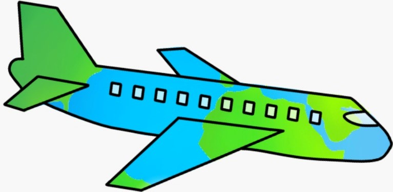

# Y*our* [World] T*our*

A website that displays you a map of the globe including all the continents and countries to choose from and gives you the ability take an online trip through various cultures.

 

 

# **Project Description**

### Static Part:

We are putting our focus on the cultures, recipes, sights and the population of each destination. With detailed research, we want to give travel enthusiasts and entrepreneurs a new opportunity to display all the most important information about each country at once.

### Dynamic Part:

In order to select a country you have to klick on a continent on the 3D-globe to get a zoomed-in and more detailed version. When the user has chosen the desired destination, a simulated airplane makes its way to it. From there on, it shows the user all the information about the country.
In the second semester, we want to use the online data resource and provide a request formular for data from the site: [Our World Data](https://ourworldindata.org/)

 

## **Milestones**

1. Research on recipes, cultures, sights and population of each country until Halloween (31.10.2022).

2. Design a logo, the website and 3D-globe with all destinations until the semester break (27.02.2022).

3. Display all countries on the 3D-world and be able to click on them until the end of the year.

4. Insert information to each country and simulate air plane by end of submission.

5. Presentation< on the agreed date.

 

## **Environmental Analysis and Risks**

### Audience Group:
* Travel enthusiasts can use our website to find out about new destinations and their most important conditions. 
* Likewise, entrepreneurs who want to work internationally and learn about cultures, can use our website as well.

### Technologies:
* We want to use the most famous web technologies like: HTTP, HTML, CSS and Java Script for our project.

### Potential Risks:
* For project members: Risks that could have an impact on our project are, that we may take on too much and not be able to insert all the features into our project.
* For the environment: When the finished website is in use, users may travel more with airplanes to different continents, which is not good for the environment.

 

## **Project Members**

* Abazovic Emina
  * Research: North America, Europe
  * 3D-Globe 
* Gabeljic Amina 
  * Research: South America, Africa
  * Website Design
* and Meyr Julia
  * Research: Asia, Australia 
  * Webite Design
  * Project leader
